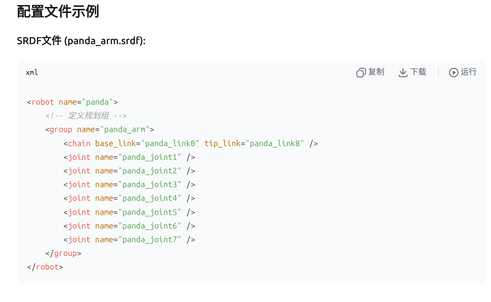

# 关节组
## 介绍
我们通常在使用MoveIt时，会定义一个规划组（planning group），比如机械臂的多个关节构成一个组，或者一个机械臂加上一个夹爪构成一个组。

这个组在MoveIt的配置中（通常在SRDF文件中）已经定义好了。

在代码中，我们通过这个规划组的名称（例如"manipulator"）来获取这个组的关节模型组（JointModelGroup）。

关节模型组包含了组内所有关节的信息，比如关节的数量、名称、限制等，并且提供了运动学计算、碰撞检测等功能。

## 用法

```C++
 const moveit::core::JointModelGroup *joint_module_group =
      move_group.getCurrentState()->getJointModelGroup(PLANNING_GROUP);
```

这样就获得了关节组的指针



这就是关节组

```C++
ROS_INFO("规划组 '%s' 包含 %d 个关节:", 
         joint_model_group->getName().c_str(),
         joint_model_group->getJointModelNames().size());
```
使用这两句获得关节组的信息

```C++
// 获取关节限制
for(const auto& joint_name : joint_names) {
    const moveit::core::JointModel* joint = joint_model_group->getJointModel(joint_name);
    if(joint->getType() == moveit::core::JointModel::REVOLUTE) {
        const moveit::core::RevoluteJointModel* revolute_joint = 
            static_cast<const moveit::core::RevoluteJointModel*>(joint);
        ROS_INFO("关节 %s 限制: [%f, %f]", 
                 joint_name.c_str(),
                 revolute_joint->getMinBound(),
                 revolute_joint->getMaxBound());
    }
}
```
获得限位

# move
```C++
moveit::planning_interface::MoveGroupInterface move_group(move_group_node,PLANNING_GROUP);
move_group.move();
```

move()函数。请注意，我们之前设置的位姿目标仍然有效，因此机器人将尝试移动到该目标。本教程中我们不会使用该函数，因为它是一个阻塞函数，需要控制器处于活动状态并在执行轨迹时报告成功。

# moveit_visual_tools

## 创建对象
```C++
  moveit_visual_tools::MoveItVisualTools visual_tools(
      move_group_node, PLANNING_GROUP, "move_group_tutorial",
      move_group.getRobotModel());
```
指定好你的node，还有PLANNING_GROUP的名字，还有topic，和module